# Analysis of Attacks on Secure Messaging Applications (SIMs)
This project is made after the paper 'Practical Traffic Analysis Attacks on Secure Messaging Applications' written by Alireza Bahramali∗ , Amir Houmansadr∗ , Ramin Soltani† , Dennis Goeckel‡ , and Don Towsley∗

The main focus of this project is to offer a brief overview and key-point to the aforementioned paper, and dissect graphs and data generated based on sniffed .pcap files (using Wireshark utility tool) which will late be used as .csv files (which were created by converting the .pcap files using Wireshark  as well)
A python script will be used in order generate various types of graphs by taking the relevant network packet data- 
by utilizing the 'Scapy' library for network packet processing, 'pandas' for data manipulation, 'numpy' for numerical computations, and 'matplotlib' for graph generation. 
The script reads data from CSV files containing network packet information and generates PDF function graphs, Inter-Message-Delay (IMD) graphs, and Complementary Cumulative Distribution Function (CCDF) graphs. Further elaboration on those graphs will be provided further below.

## Prerequisites

Before using the Python script, ensure you have the following prerequisites:

1. Python 3.x installed.
2. Required libraries: scapy, pandas, numpy, and matplotlib. You can install them using the following command:

```bash
pip install scapy pandas numpy matplotlib
```
3. Placed .csv files inside the ```resources/csvs/``` directory
4. If you have only a .pcap file, you can convert that file to a readable .csv file for the script using this quick guide: https://www.linkedin.com/advice/1/how-do-you-export-share-network-analysis-results#:~:text=To%20do%20that%2C%20you%20can,levels%20of%20detail%20and%20structure.
## How to use
To use the Python script, follow these steps:

1. Download or clone the repository to your local machine.
2. Open a terminal and navigate to the downloaded folder.
3. Run the following command to execute the script:
```bash
python ./src/main.py
```
4. To see the generated graphs, check the ```results/``` folder

## Notes
 - Please ensure that the two columns required for the script to work: ['Time'] and ['Length'] are present and correctly named(as shown here) in the CSV files which are used for analysis. The script depends on specific column names.
 - The script deletes *all* files and directories that may be present in the ```results/``` folder. If you need to make any backups, move the files to a different, *external* directory.
    


## Graph Generation
The script generates the following types of graphs from interpreted CSV files:
PDF and IMD graphs will generate separatley per each .csv file, while the CCDF will be generated for all .csv files provided (Take this into notice when running the script)

#### PDF Function Graph:  
The PDF (Probability Density Function) graph depicts the probability density of inter-message delays within network packet data. This graph presents a confined probability density where captured packets with an Inter-Message-Delay greater than 0 tend towards zero probability of containing SIM program content.  

#### Packet Length relative to Inter-Message-Delay (IMD) over Time Graph:  
This graph illustrates how packet length varies across time intervals, offering valuable insights into network traffic patterns. Analyzing sequences of SIM communication, as outlined in the paper, reveals that over a specific time frame, the density and sizes of transmitted packets distinctly suggest the transmission of different message types (such as audio, text, photos, videos, or documents) by the SIM program.  

#### Complementary Cumulative Distribution Function (CCDF) Graph:  
The CCDF graph illustrates the complementary cumulative distribution of normalized message sizes, aiding in the analysis of message size distribution. Through the normalization of packet lengths in each .csv file range, we calculate the Complementary CDF probability, indicating the likelihood that the subsequent packet in the sequence is not related to the previous one sent by the SIM. This graph demonstrates that as the normalized packet size approaches 1, the probability of irrelevance approaches 0.  

In accordance with the CCDF definition, the curve portrays the probability that a Group's IM Size (normalized message size), represented by the random variable x, exceeds a given value on the x-axis.  
Those graphs are in accordance to figures 2,3 and 4 in the paper.


## Explained Examples

### Two observation cases
During our graph generation process we made a distinction between two cases:
- The first case:
  The attacked user is always active in (at most) a single wiretapped IM group
  there are two stages for this case - one without noise (i.e, while capturing packets of whatsapp in wireshark, there is no other website that is used) , and one with noise (i.e, while capturing         packets of whatsapp in wireshark, we are using Spotify in the background).
- The second case:
  The attacked user may be active (simultaniously or consecutively) in multiple of the wiretapped IM groups. Here we also took into account two scenarios with and without noise (similarly to the first case)

#### Case 1
##### Without noise

and for all the groups, we have a graph that shows the Complementary Cumulative Distribution Function (CCDF) for normalized message size distributions across various message types (fig. 4): distinct lines or curves on the graph correspond to different message types, allowing for a comparative analysis of their IM Size distributions.


## 1. Inter-Message-Delay Graphs :
as we can see, the packet length changes over time , in dependency of the way we've sent the messages in each interval. for example , in the text group graph, we can see that most of the messages were sent in batches or "bursts", since we did a lot of forwarding batches (the attacked user sends a group of messages that were sent in other whatssapp groups), and the length of most of the packets is smaller than 500. As opposed to the text group graph ,in the pics and video groups graphs, the length of most of the packets is between 2500 and 3000.

In the pics graph, we can see that most of the messages were sent in groups or "bursts" , similar to the text graph, but in the video graph , most of the messages were sent seperately , i.e, one video at a time (since the bars are thinner in the video graph).

examples of graphes - fig. 2:

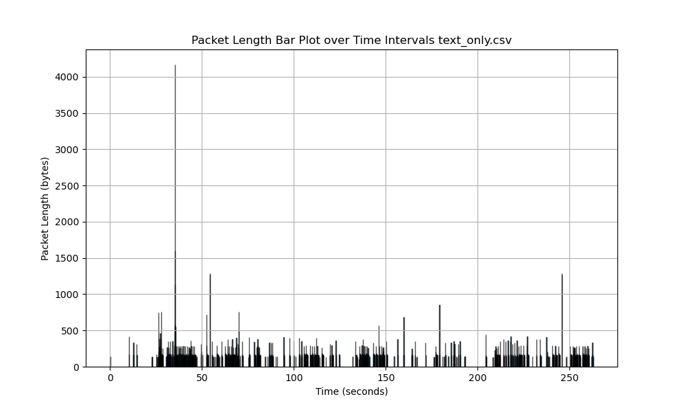

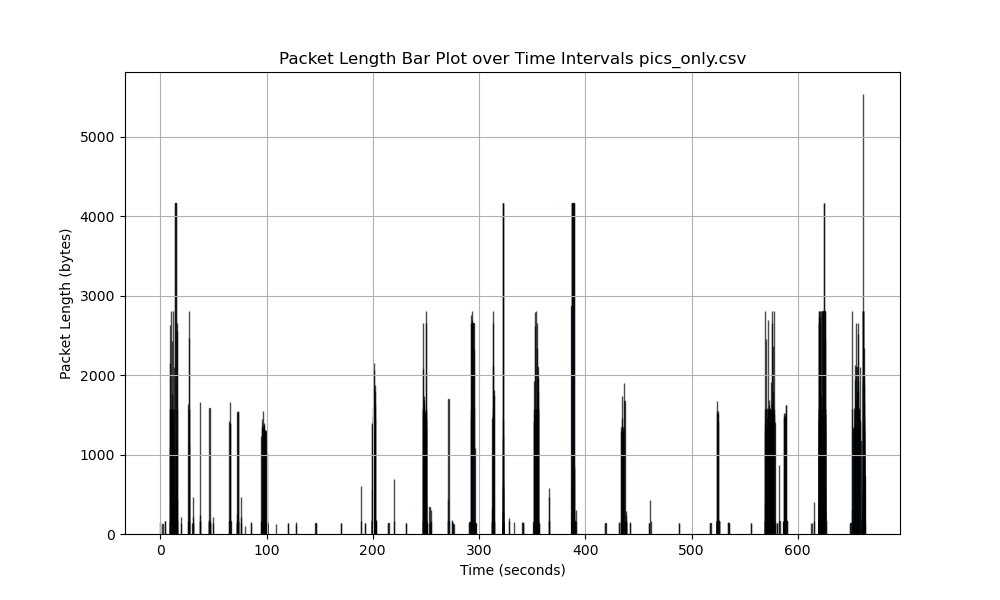


## 2. fig. 3:
in the pdf graphs, the main reason for the distribution we've got is the way we've sent the messages. for example, in the pics and text groups, we've sent a lot of the messages together (in the text group- by forwarding , and in the pics- as a group of pictures), so the probability of big imds in those groups is smaller than the probability of big imds in the video group , since in this group, we've sent most of the videos seperately and not as a batch, so that the probability of having packets thart their IMD is bigger than 0 is bigger. this is why the PDF distribution is different in the video graph (there are peaks after x=0 too).

examples of graphes - fig. 3:

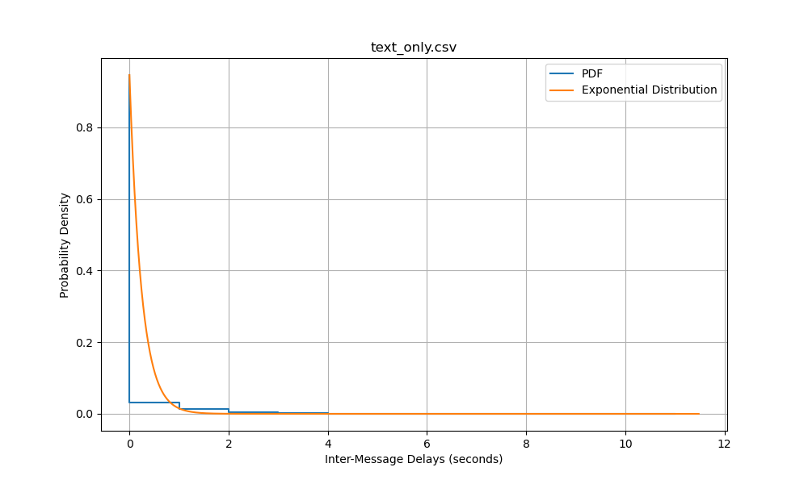

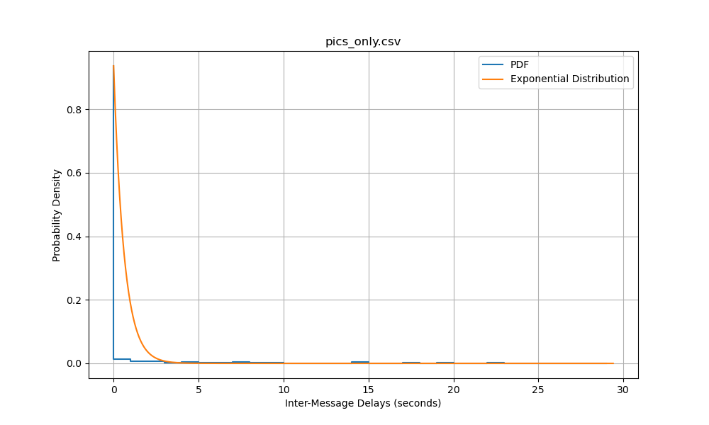


## 3. fig. 4:
ccdf explanation: according to the definition of CCDF, the curve depicts the probability that an IM Size (normalized message size) of the group (this is the random variable x) is bigger than a given value of the x-axis.

we can see that for all the groups, when x=0, the probability that the message size is bigger than x is 1, since all of the messages wev've sent (normalized) have a size bigger than 0. and as x grows, we can see that each curve grows smaller (each one with respect to the frequency of the message sizes for the group), since these values are similar to the values of the normalized message sizes. and when x=1, the probability that the message size is bigger than x is zero , since all of the messages wev've sent (normalized) have a size smaller than the maximum size of message sizes (normalized).


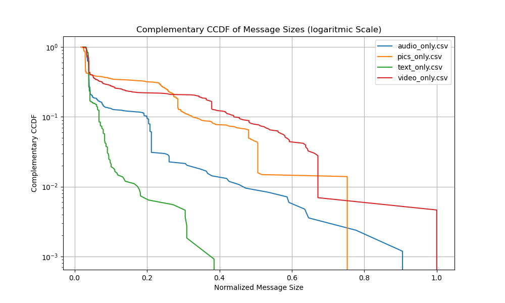


## with noise 

***note - in this part, we've only recorded 2 types of groups - texts and pictures, since we've seen in the previous part (without noise), that the traffic on the text and audio groups and on the pictures and video groups is pretty simillar , in both packet lengths ranges and shape.

as we've mentioned before, the meaning of noise is capturing packets of whatsapp in wireshark, while using Spotify in the background.

fig. 2 - noise , no filtered: 

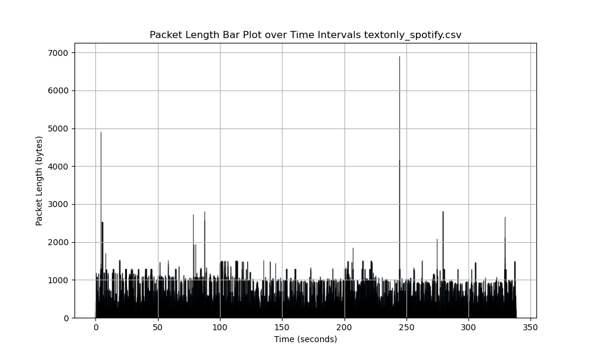

fig. 3 - noise , no filtered: 

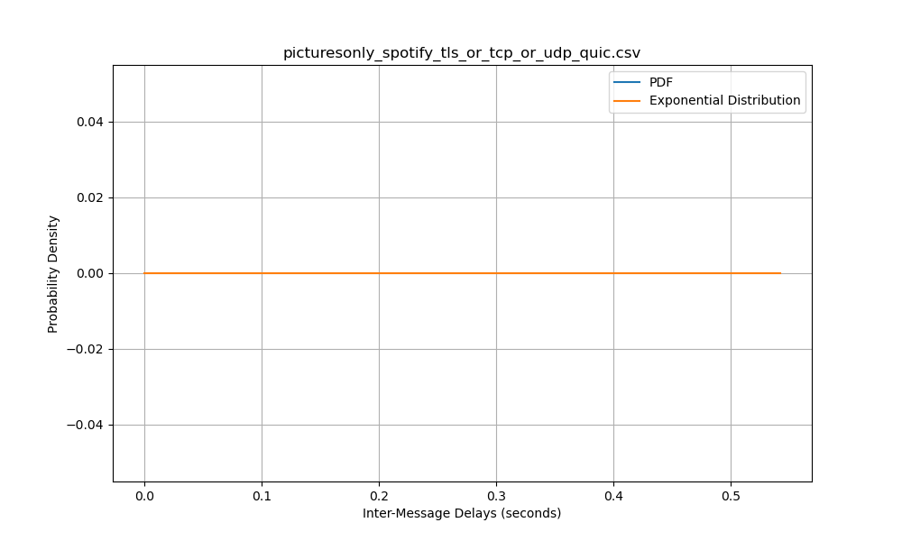


as we can see from the fig. 2 (packet length) above, since we didn't apply any filtering on the traffic , all of the packets are seen as "bursts" , hence the ranges of IMD are really small and close to 0 (this is due to the fact the Spotify keeps sending packets non-stop ,as long as we keep using it in the background). therefore, in the fig. 3 (PDF graph), we can see that without the filtering , we got a lot of packets with a very small range of IMD values , which made the PDF graph have an equal probability for each IMD of the packets ,and it wasn't able to detect the IMD values since they are very simillar.

this is why we decided to filter the traffic : the filters we have applied in this part (as we've mentioned in the documentation) are : tls || tcp || udp || quic , since tls is the protocol of whatssapp and all the others are protocols of Spotify .

fig. 2 - noise , filtered: 

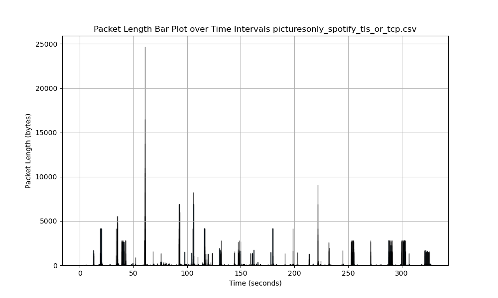

fig. 3 - noise , filtered: 

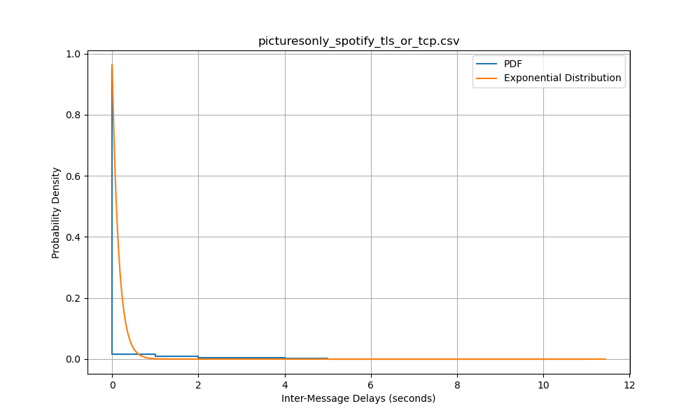


as we can see, in fig. 2 with the filtering , the packet lengths are smaller , as we have filtered some of the traffic (the packets with the protocols that aren't the whatssapp or spotify protocols), but almost all of the traffic is still seen as "bursts", but this time , as we can see in fig. 3 , the IMD range is wider , due to the fact that traffic was reduced.


# case 2

this is the case where the attacked user may be active in several IM groups simultaneously.
just like the first case, there are two stages for this case - one without noise and one with noise

## without noise

fig.2 - no noise

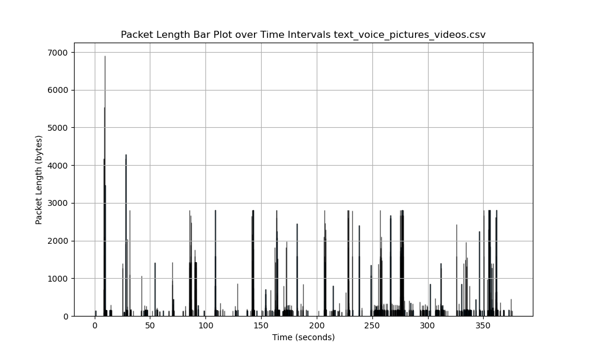


fig. 3 - no noise

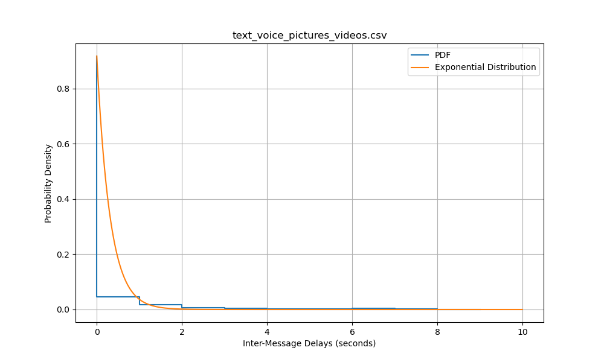

as we can see here, the traffic when the attacked user is active in several IM groups simultaneously (with no noise) is simillar to the traffic of case 1 (no simultaneously) with no noise of the pics and video groups, in regards to the range of the packet length, since it combines the traffic of all the groups , so that the packets with the biggest length are the ones from the pics and video groups (of course that there is also the chance of a very long text message). In addition , the sending ratio is simillar to the graphs in case 1 with no noise,  since we've tried to make a comparison between these graphs that is independent of the sending rate (so that we will actully see the difference in the traffic in dependence to the groups the user uses).


## with noise

